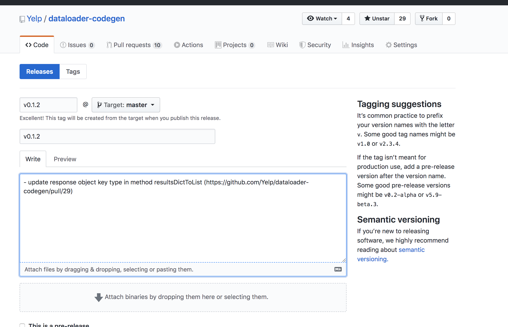

# 📚 How to publish a new version

After merging your PR to master, you may want to release a new version of **dataloader-codegen** to NPM registry. Here comes the instructions.

## Steps

1. Figure out what kind of release you want to make, `major`, `minor` or `patch`. We follow [Semantic Versioning](https://semver.org/#summary).
2. Update version in [package.json](package.json) directly in <https://github.com/Yelp/dataloader-codegen/edit/master/package.json> and commit changes
3. Draft a new release in <https://github.com/Yelp/dataloader-codegen/releases/new> with the following format. Remember to use tag `vX.Y.Z` instead of `X.Y.Z`
   
