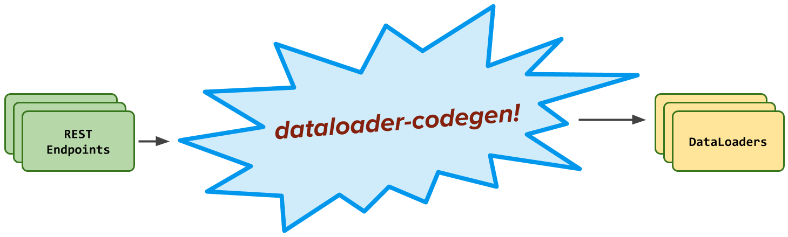

# 🤖 dataloader-codegen

[](https://yarn.pm/dataloader-codegen)
[](https://travis-ci.org/Yelp/dataloader-codegen)

dataloader-codegen is an opinionated JavaScript library for automagically generating [DataLoaders](https://github.com/graphql/dataloader) over a set of resources (e.g. HTTP endpoints), with a predictable interface, and maintains type safety.



**Features**:

-   🚚 Supports Batched + Non Batched Resources
-   ✨ Predictable DataLoader Interfaces
-   🐛 Error Handling
-   🔒 Type Safety (Flow)
-   🔧 Resource Middleware

## Install

```bash
$ yarn add --dev dataloader-codegen
```

## Why?

We believe the DataLoader layer should be (mostly) transparent when implementing
a GraphQL server over a set of existing resources (e.g. HTTP API Endpoints).

When fetching data, GraphQL resolver authors should think in terms of the
underlying _resources_ that they're already familiar with, not an invented set
of human defined DataLoaders.

With dataloader-codegen, we build a **1:1 mapping of resources to DataLoaders**:


This makes it super easy to find the DataLoaders you want - there will be
exactly 1 DataLoader available per resource, with a predictable name and interface.

This means **reduced risk of making unnecessary HTTP requests.**

If there were (accidentally!) multiple DataLoaders created for a single
endpoint, we potentially lose out on batched requests to that resource.

By keeping the mapping of one DataLoader per resource, we reduce that risk
and can make a more efficient set of HTTP requests to the underlying resource.

## Usage

1. Create `dataloader-config.yaml` to describe the shape and behaviour of your resources. (See the docs for more info.)

    **Example**

    ```yaml
    resources:
        getPeople:
            docsLink: https://swapi.co/documentation#people
            isBatchResource: true
            batchKey: people_ids
            newKey: person_id
        getPlanets:
            docsLink: https://swapi.co/documentation#planets
            isBatchResource: true
            batchKey: planet_ids
            newKey: planet_id
        ...
    ```

    _(Can be arbitrarily nested. See the [swapi example](./examples/swapi/swapi.dataloader-config.yaml) for an example.)_

2. Call `dataloader-codegen` and pass in your config file:

    ```bash
    $ dataloader-codegen --config swapi.dataloader-config.yaml --output swapi-loaders.js
    ```

    See `--help` for more options.

3. Import the generated loaders and use them in your [resolver methods](https://www.apollographql.com/docs/graphql-tools/resolvers/) as normal!

    ```js
    // StarWarsAPI returns a clientlib containing fetch calls to swapi.co
    const swapiLoaders = createSwapiLoaders.default(StarWarsAPI());

    class Planet {
        constructor(id) {
            this.id = id;
        }

        async diameter() {
            const { diameter } = await swapiLoaders.getPlanets.load({ planet_id: this.id });

            return diameter;
        }
    }
    ```

    _(See the [swapi example](./examples/swapi/swapi-server.js) to see this in context.)_

## Batch Resources

The [DataLoader `.load` interface](https://github.com/graphql/dataloader#loadkey)
accepts a single key and returns a single value. For [batch resources](https://www.codementor.io/blog/batch-endpoints-6olbjay1hd), we'll need to transform the DataLoader interface accordingly.

**Example**

Consider the following resource that returns information about users:

```js
const getUserInfo = (args: {
    user_ids: Array<number>,
    locale: string,
    include_private_info?: boolean,
}): Promise<Array<UserInfo>> => fetch('/userInfo', args);
```

This is a [batch resource](https://www.codementor.io/blog/batch-endpoints-6olbjay1hd) that accepts a list of users (`user_ids`) and returns a list of corresponding user objects (`Array<UserInfo>`).

For the DataLoader version of this, we'll want to instead ask for a _single_ user
object at a time. This means we need to transform the interface in the following
ways:

1. Call `.load` with the same arguments, but switch "user*ids" to "user_id".
   (\_Because we're only asking for the one user!*)

2. Return a _single_ `UserInfo` object from `.load`, instead of an _array_ of
   `UserInfo` objects.


We can control this by specifying `batchKey` and `newKey` in the config to
describe the relevant argument in the resource and DataLoader respectively.

The config for our `getUserInfo` would therefore look like this:

```yaml
resources:
    getUserInfo:
        isBatchResource: true
        batchKey: user_ids
        newKey: user_id
```

See the docs for more information on how to configure resources.

## Contributing

Pull requests are welcome. For major changes, please open an issue first to discuss what you would like to change.

Please make sure to update tests as appropriate.

## License

[MIT](https://choosealicense.com/licenses/mit/)
